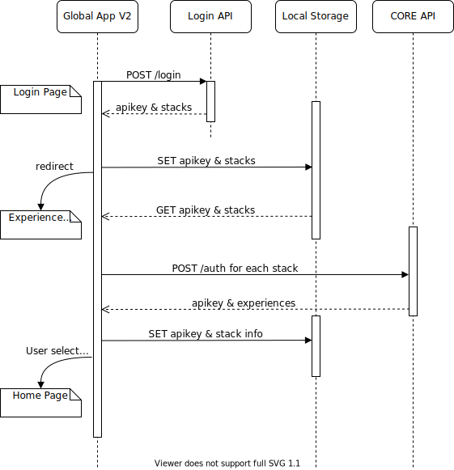
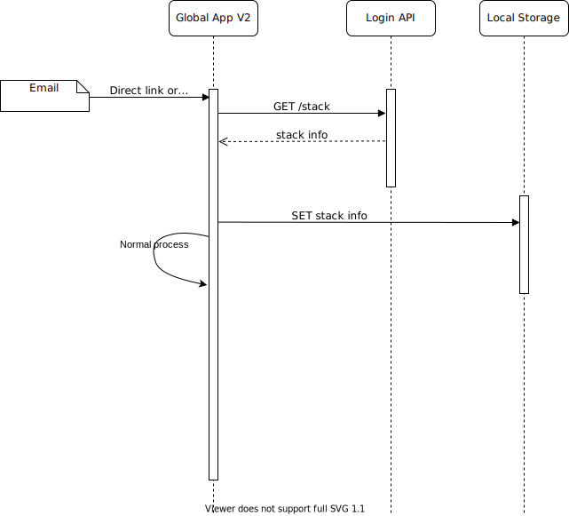

# Authentication Workflow

This documentation explains the workflow related to authentication process. Including the code execute steps, and the APIs that are used etc.

## Login Flow

This conatains information about how login works inside App.

To log user in, we use both login API and core API.

### General logic

- Use Login API to authenticate user.
  - Login API will return a list of App stacks that the user is in.
  - Each stack includes url for core, graphql, chat-api etc.
  - Store stacks info in to the local storage to use in experience switcher page.
- Redirect the user to the experience switcher page.
- Send requests to core url for each stack to get the list of experiences for the user.
- Once user selected an experience, store the related stack info in local storage for future requests.



### code execute steps

1. User enter username and password and clicks on login button.
1. Make API request to Auth service login method. `authService.login`.

   - `authService.login` makes request to login API with `username` and `password`.
   - Sample

   ```ts
   this.authService.login({
     username: this.loginForm.value.username,
     password: this.loginForm.value.password,
   });
   ```

1. Auth service invokes the `post()` from request service `request.post`.

   - request body - `username` and `password` and `from`.
   - sample

   ```ts
   this.request.post(api.loginAPI.login, body, {}, true);
   ```

1. After login api return success response. login component will save `Stacks` and `apikey` in local storage and redirect user to switcher page.
1. After switcher page load call Auth service directLoginWithApikey method for each stack to get expreance list of stack. `authService.directLoginWithApikey`.

   - `authService.directLoginWithApikey` call core API to login user with `apikey` and `service`.
   - `apikey` is from the response of `authService.login`.
   - sample

   ```ts
   this.authService.directLoginWithApikey({
    apikey: globalRes.apikey,
    service: "LOGIN",
   });
   ```

1. Auth service invokes the `post()` from request service `request.post`.

   - request body - `apikey` getting from login API.
   - serviceHeader - `LOGIN` indicates that the apikey is generated from the Login API.
   - sample

   ```ts
   this.request.post(api.login, body.toString(), {
    headers,
   });
   ```

1. core API will return timeline, programs related to login user.

## Direct link/deep link Workflow

- Global App V2 uses the Global Login API for authentication.
- Direct link/deep link need to contain stack_uuid as a parameter
- Global App V2 will use the stack_uuid to get stack information from Global Login API
- Once get the stack information, store those info in local storage 
- Use the urls from the stack for normal direct link/deep link checks and actions


## Registration Flow

This conatains information about new user registration process.

To rester a new user, we use both login API and core API. After user registered successfully, user will automatically login to the app.

### General logic

- Get stack infomation when naviagte to app from url.
- Save stack information in local storage.
- Use Core API to validate registration link.
- Use Core API to Register the new user to the system.
- Use Login API to authenticate user.
  - Login API will return a list of App stacks that the user is in.
  - Each stack includes url for core, graphql, chat-api etc.
  - Store stacks info in to the local storage to use in experience switcher page.
- Redirect the user to the experience switcher page.
- Send requests to core url for each stack to get the list of experiences for the user.
- Once user selected an experience, store the related stack info in local storage for future requests.



### code execute steps

1. When page locading Make API request to auth service verifyRegistration method. `authService.verifyRegistration`.
   - `authService.verifyRegistration` make Core API call with `email` and `key`.
   - sample

   ``` ts
   this.authService.verifyRegistration({
    email: this.user.email,
    key: this.user.key
   })
   ```

1. Auth service invokes the `post()` from request service `request.post`.
   - request body - `email` and `key`.
   - sample

   ```ts
   this.request.post(api.verifyRegistration, data, {
    headers: { 'Content-Type': 'application/json' }
   });
   ```

1. User enter password and confirm the password and clicks on register button.
1. In `auth-regitration.component.ts` `register()` method get call.
1. Make API request to auth service saveRegistration method. `authService.saveRegistration`.

   - `authService.saveRegistration` make Core API call with `password` and `user_id` and `key`.
   - sample

   ```ts
   this.authService.saveRegistration({
    password: this.confirmPassword,
    user_id: this.user.id,
    key: this.user.key,
   });
   ```

1. Auth service invokes the `post()` from request service `request.post`.
   - request body - `password` and `user_id` and `key`.
   - sample

   ```ts
   this.request.post(api.register, data, {
    headers: { 'Content-Type': 'application/json' }
   });
   ```

1. After registration request return success response. `auth-regitration.component.ts` start auto login process.
   - Make API request to auth service login method. `authService.login`.
   - `authService.login` make login API call with `username` and `password`.
   - Sample

   ```ts
   this.authService.login({
    username: this.loginForm.value.username,
    password: this.loginForm.value.password,
   });
   ```

1. Auth service invokes the `post()` from request service `request.post`.

   - request body - `username` and `password` and `from`.
   - sample

   ```ts
   this.request.post(api.loginAPI.login, body, {}, true);
   ```

1. After login api return success response. login component will save `Stacks` and `apikey` in local storage and redirect user to switcher page

1. After switcher page load call Auth service directLoginWithApikey method for each stack to get expreance list of stack. `authService.directLoginWithApikey`.

   - `authService.directLoginWithApikey` make core API call with `apikey` and `service`.
   - request body - `apikey` is from the response of `authService.login`.
   - sample

   ```ts
   this.authService.directLoginWithApikey({
    apikey: globalRes.apikey,
    service: "LOGIN",
   });
   ```

1. Auth service invokes the `post()` from request service `request.post`.

   - request body - `apikey` getting from login API.
   - serviceHeader - `LOGIN` indicates that the apikey is generated from the Login API.
   - sample

   ```ts
   this.request.post(api.login, body.toString(), {
    headers,
   });
   ```

1. core API will return timeline, programs related to login user.
